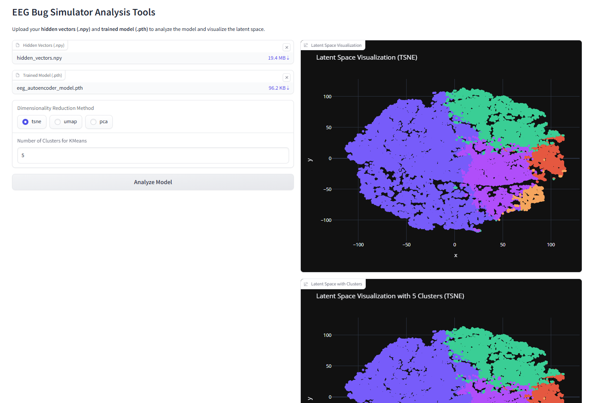

# EEG AI MODEL POWERED BUGS Project

A notebook LM Deepdive with the bugs in action video at youtube

https://www.youtube.com/watch?v=_QaS5uLAeWI

## Overview

The **EEG BUGS Project** is a comprehensive toolkit designed for analyzing EEG (Electroencephalography) data and visualizing intelligent simulations based on neural insights. This project comprises two main components:

1. **EEG AI Model Maker:** A tool for training an EEG autoencoder model using `.edf` files.
2. **EEG Bug Simulator:** An interactive simulation where intelligent bugs navigate environments influenced by EEG-derived data.

## Features

### EEG AI Model Maker
- **Train EEG Autoencoder:** Process EEG `.edf` files to train a convolutional autoencoder model.
- **Configuration Options:** Customize training parameters such as epoch length, batch size, number of epochs, and learning rate.
- **Progress Monitoring:** Real-time training progress with logs and checkpointing.
- **Save Models:** When the model is done download the pth model and then when you launch the EEG bugs software choose that as eeg model. (Hidden vectors file is also made)

### EEG Model explorer 

- Handy tool to explore the PTH / NPY file created by the model maker. 

### EEG Bug Simulator
- **Intelligent Bugs:** Simulate bugs with configurable wave neurons that interact based on EEG data.
- **Dynamic Vision:** Bugs have a defined vision cone to detect other bugs and environmental inputs.
- **Communication:** Bugs share their internal states through ASCII-based messages derived from neural activations.
- **Drawing Capability:** Visual trails and echo traces represent bug interactions and behaviors.
- **Flexible Input Sources:** Choose between webcam feeds or static background images for simulation environments.

## Installation

1. **Clone the Repository:**

    git clone https://github.com/anttiluode/eegbugs.git

    cd eegbugs
   
3. **Install Dependencies:**
 
    pip install -r requirements.txt
    
    *`requirements.txt` should include:*

    numpy
    torch
    mne
    scipy
    tqdm
    matplotlib
    pillow
    opencv-python
    
## Usage

### 1. Train the EEG Autoencoder Model

Before running the simulator, you need to train the EEG autoencoder model using the **EEG AI Model Maker**.

   cd EEGAIModelMaker
   
2. **Run the Model Maker:**
 
    python eeg_ai_model_maker.py
   
    
4. **Configure and Train:**

    - Find .edf ending EEG file from online. 
    - **Load EDF File:** Click the **Browse** button to select your `.edf` EEG data file.
    - **Set Parameters:** Adjust training parameters as needed (epoch length, batch size, etc.).
    - **Start Training:** Click the **Start Training** button to begin. Monitor progress through the interface.
    - **Completion:** Upon training completion, the model (`eeg_autoencoder_model.pth`) and hidden vectors (`hidden_vectors.npy`) can be downloaded. 

### 2. Run the EEG Bug Simulator

With the trained model, you can now launch the **EEG Bug Simulator** to visualize intelligent bug interactions.

    python app.py

**Configure and Start:**

    - **Select EEG Model:** In the **Configuration** tab, click **Browse** to select the trained `.pth` model from the `features` directory.
    - **Choose Input Source:** Select between using a webcam or uploading a background image.
    - **Configure Wave Neurons:** Set the number of wave neurons per bug to influence their behavior.
    - **Start Simulation:** Click the **Start Simulation** button to begin. Observe bugs interacting in real-time within the simulation canvas and discussion sidebar.
    - Notice the simulation runs in its own tab.

### The EEG model explorer

run 

python EEG_model_explorer.py

The Explorer is a sophisticated tool designed to facilitate the in-depth analysis and visualization of EEG (Electroencephalography) data through the utilization of advanced machine learning models. At its core, the Explorer leverages a pre-trained EEG Autoencoder model to interpret complex neural data, transforming raw EEG signals into meaningful latent representations. This transformation is crucial for unraveling the intricate patterns and features inherent in brain activity, enabling researchers and clinicians to gain deeper insights into neurological processes.

One of the primary functionalities of the Explorer is its ability to accept and process two critical inputs: hidden vectors and trained model files. Users begin by uploading a NumPy file containing the hidden vectors, which represent the condensed information extracted from the EEG data by the Autoencoder. Simultaneously, users provide the corresponding trained model file, typically saved in the .pth format, which encapsulates the learned parameters of the neural network. This dual-upload system ensures that the Explorer has all the necessary components to accurately interpret and analyze the EEG data.

Once the necessary files are uploaded, the Explorer undertakes a series of analytical procedures aimed at distilling the latent vectors into actionable insights. The first step involves dimensionality reduction, a process that simplifies the high-dimensional latent space into a more manageable form without significant loss of information. The Explorer offers multiple dimensionality reduction techniques, including t-SNE (t-distributed Stochastic Neighbor Embedding), UMAP (Uniform Manifold Approximation and Projection), and PCA (Principal Component Analysis). Users can select their preferred method based on the specific requirements of their analysis, balancing between computational efficiency and the preservation of data structure.

Following dimensionality reduction, the Explorer performs clustering on the reduced data. By applying algorithms such as K-Means, the tool groups similar latent vectors into distinct clusters. This clustering is instrumental in identifying underlying patterns and similarities within the EEG data, which may correspond to different cognitive states, neurological conditions, or responses to stimuli. The number of clusters can be customized by the user, allowing for flexible exploration tailored to the granularity of the desired analysis.

The Explorer's visualization capabilities are another standout feature, providing users with interactive and intuitive representations of their data. The latent space visualization plots the reduced-dimensional vectors, enabling users to observe the overall distribution and clustering of EEG data points. Additionally, the clustered latent space visualization overlays the identified clusters onto the plot, offering a clear depiction of groupings and their separations. These visualizations are crafted using Plotly, ensuring high interactivity, responsiveness, and aesthetic appeal, which are essential for effective data interpretation.

Beyond visualization, the Explorer delves into statistical analysis to furnish users with quantitative metrics about their latent space. This includes calculating the mean, standard deviation, minimum, and maximum values across latent dimensions, as well as identifying active dimensions that exhibit significant variance. Furthermore, the tool computes the correlation coefficients between different latent dimensions, providing insights into the relationships and dependencies within the data. These statistics are presented in a structured JSON format, facilitating easy integration with other analytical tools or workflows.

The Explorer also maintains robust error handling and logging mechanisms to ensure smooth operation and user support. Should any issues arise during the analysis—such as incompatible file formats, mismatched model architectures, or data processing errors—the tool logs detailed error messages to a designated log file. Simultaneously, it communicates user-friendly error notifications within the interface, guiding users to rectify the problems without delving into technical jargon. This dual-layered approach enhances user experience by combining technical transparency with accessibility.

User customization and flexibility are integral to the Explorer's design. By allowing users to choose between different dimensionality reduction methods and specifying the number of clusters, the tool accommodates a wide range of analytical scenarios and research questions. Whether a user is interested in broad patterns across the entire dataset or in fine-grained distinctions between specific EEG signals, the Explorer adapts to meet these needs. This adaptability makes it a versatile tool suitable for various applications, from clinical diagnostics to cognitive neuroscience research.

Security and data privacy are also paramount considerations in the Explorer's architecture. By handling file uploads through secure temporary storage mechanisms and ensuring that sensitive EEG data is not retained longer than necessary, the tool safeguards user data against unauthorized access or breaches. Additionally, the processing of data is confined to the user's session, minimizing exposure and aligning with best practices in data protection. These measures are critical in environments where EEG data may contain sensitive personal information.

The Explorer's integration with Gradio—a popular Python library for building interactive web interfaces—further enhances its accessibility and ease of use. Gradio facilitates the creation of a user-friendly interface that requires no prior web development knowledge, allowing researchers and clinicians to focus on their analysis rather than technical setup. The public sharing feature of Gradio also enables collaborative work, where users can share their analysis results and visualizations with peers or stakeholders effortlessly through generated URLs.

In conclusion, the Explorer stands as a powerful and comprehensive tool for EEG data analysis, merging advanced machine learning techniques with user-centric design. Its ability to process complex neural data, perform sophisticated analyses, and present findings through interactive visualizations empowers users to uncover nuanced insights into brain activity. By prioritizing flexibility, security, and usability, the Explorer not only accelerates the pace of neurological research but also broadens its applicability across diverse scientific and clinical domains. As EEG technology and data analysis methodologies continue to evolve, tools like the Explorer will remain essential in bridging the gap between raw data and meaningful interpretation.

## License

This project is licensed under the [MIT License](LICENSE).

**Enjoy exploring the fascinating dynamics of EEG-driven intelligent simulations!** 🧠✨

